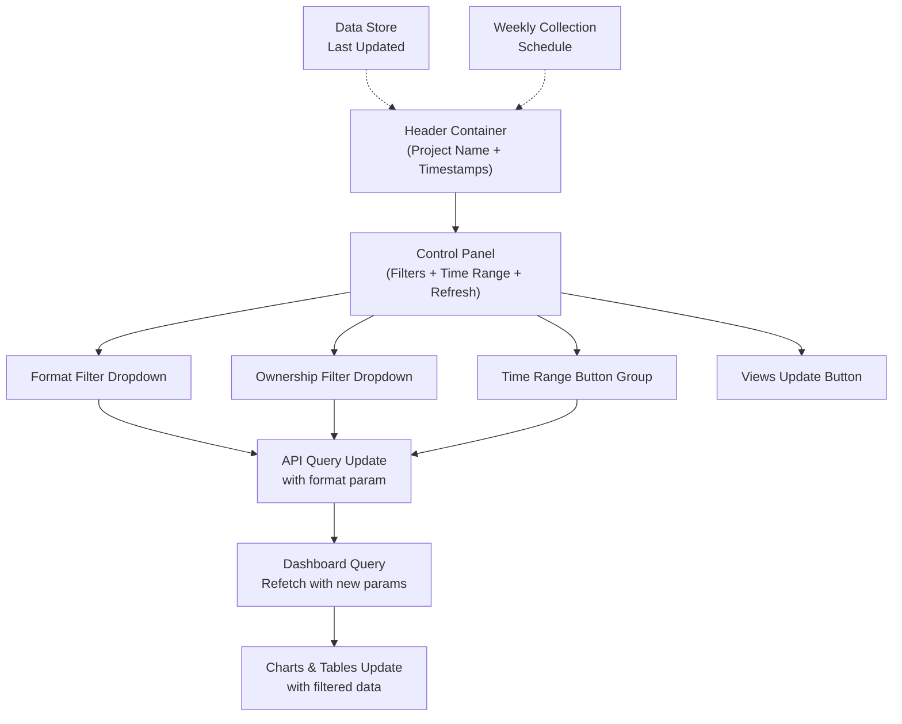

# Design Document: Dashboard Format Filter and Controls Redesign

## Overview

This feature enhances the SOV Panel dashboard's header controls with three key improvements: (1) a new format filter dropdown enabling users to segment analysis by video format (All/Long Format/Short Format), (2) timestamp displays showing last updated time for views data and weekly run time below the project name, and (3) a redesigned control panel that consolidates filters, time range selection, and refresh functionality into a cleaner, more coherent UI following modern dashboard patterns.

The design maintains consistency with existing UI patterns (tab-pill styling, button grouping) while introducing new affordances for format-based filtering and improved visibility into data freshness and collection timing.

## Architecture



## Components and Interfaces

### Component 1: Header Section

**Purpose**: Display campaign name with timestamp information indicating data freshness and collection timing.

**Interface**:
```typescript
interface HeaderProps {
  campaign: Campaign | null
  hasData: boolean
  overview: Overview | null
  lastViewsUpdate: Date | null
  weeklyCollectionTime: Date | null
}

function Header({ 
  campaign, 
  hasData, 
  overview, 
  lastViewsUpdate, 
  weeklyCollectionTime 
}: HeaderProps) {
  // Renders campaign name, stats, and timestamps
}
```

**Responsibilities**:
- Display campaign name with "Live" badge when data exists
- Show summary stats (keywords, videos, creators count)
- Display last views update timestamp with formatted time
- Display weekly run time for data collection
- Maintain visual hierarchy and spacing

### Component 2: Control Panel

**Purpose**: Consolidated container for all dashboard filters and actions, replacing the current scattered layout.

**Interface**:
```typescript
interface ControlPanelProps {
  formatFilter: FormatFilter
  onFormatFilterChange: (format: FormatFilter) => void
  ownershipFilter: OwnershipFilter
  onOwnershipFilterChange: (ownership: OwnershipFilter) => void
  timeRange: TimeRange
  onTimeRangeChange: (range: TimeRange) => void
  isRefetching: boolean
  onRefresh: () => void
}

type FormatFilter = 'all' | 'long' | 'short'
type OwnershipFilter = 'all' | 'ours' | 'theirs'
type TimeRange = '7' | '14' | '30'

function ControlPanel({
  formatFilter,
  onFormatFilterChange,
  ownershipFilter,
  onOwnershipFilterChange,
  timeRange,
  onTimeRangeChange,
  isRefetching,
  onRefresh,
}: ControlPanelProps) {
  // Renders control panel with all sub-components
}
```

**Responsibilities**:
- Manage layout and spacing of all control elements
- Coordinate filter selections through callback props
- Display refresh state and loading feedback
- Maintain consistent styling across all controls
- Handle responsive behavior on smaller screens

### Component 3: Format Filter Dropdown

**Purpose**: Allow users to filter dashboard content by video format (Long Format/Short Format/All).

**Interface**:
```typescript
interface FormatFilterProps {
  value: FormatFilter
  onChange: (format: FormatFilter) => void
}

type FormatFilter = 'all' | 'long' | 'short'

function FormatFilter({ value, onChange }: FormatFilterProps) {
  // Renders format filter dropdown matching existing UI patterns
}
```

**Responsibilities**:
- Present format options in dropdown menu
- Match styling of existing "All Videos" dropdown
- Apply selection state visually
- Trigger onChange callback with new selection
- Support keyboard navigation and accessibility

### Component 4: Views Update Button

**Purpose**: Replace "Refresh" button with "Views Update" naming and trigger dashboard data refresh with UI feedback.

**Interface**:
```typescript
interface ViewsUpdateButtonProps {
  isLoading: boolean
  onUpdate: () => Promise<void> | void
  lastUpdate?: Date
}

function ViewsUpdateButton({ isLoading, onUpdate, lastUpdate }: ViewsUpdateButtonProps) {
  // Renders Views Update button with loading state
}
```

**Responsibilities**:
- Display "Views Update" label with loading spinner during refresh
- Provide visual feedback (button disable state, spinner animation)
- Call onUpdate callback when clicked
- Show last update time in tooltip or adjacent text
- Prevent multiple simultaneous refresh requests

## Data Models

### Format Filter Data Model

```typescript
interface FormatFilterState {
  selected: FormatFilter
  availableFormats: Array<{
    id: FormatFilter
    label: string
    description: string
    videoCount?: number
  }>
}

// Example available formats:
const availableFormats = [
  { id: 'all', label: 'All', description: 'All video formats' },
  { id: 'long', label: 'Long Format', description: 'Videos > 60 seconds' },
  { id: 'short', label: 'Short Format', description: 'Videos ≤ 60 seconds' },
]
```

**Validation Rules**:
- Format filter must be one of: 'all', 'long', 'short'
- Default value is 'all'
- Selected format must exist in availableFormats
- Format change triggers data refetch with format query parameter

### Timestamp Data Model

```typescript
interface TimestampData {
  lastViewsUpdate: Date | null
  weeklyCollectionTime: Date | null
  weeklyCollectionDayOfWeek: number // 0=Sunday, 6=Saturday
  dataFreshnessMinutes: number // Minutes since last update
}

interface FormattedTimestamp {
  time: string // e.g., "3:45 PM"
  date: string // e.g., "Jan 15"
  relativeTime: string // e.g., "5 minutes ago", "Weekly on Monday 11 PM"
  isStale: boolean // true if > 24 hours old
}
```

**Validation Rules**:
- lastViewsUpdate must be a valid ISO date or null
- weeklyCollectionDayOfWeek must be 0-6 if provided
- dataFreshnessMinutes must be non-negative
- stale threshold is 24 hours (1440 minutes)

### Control Panel State

```typescript
interface ControlPanelState {
  formatFilter: FormatFilter
  ownershipFilter: OwnershipFilter
  timeRange: TimeRange
  isRefetching: boolean
  lastRefreshTime: Date | null
  refreshError: Error | null
}
```

**Validation Rules**:
- timeRange must be one of: '7', '14', '30' (days)
- ownershipFilter must be one of: 'all', 'ours', 'theirs'
- At most one filter can trigger a refetch at a time
- formatFilter + ownershipFilter + timeRange form the composite query key

## Algorithmic Pseudocode

### Main Format Filtering Algorithm

```pascal
ALGORITHM applyFormatFilter(videos, formatFilter)
INPUT: videos (array of video objects), formatFilter ('all' | 'long' | 'short')
OUTPUT: filteredVideos (array of video objects matching format)

BEGIN
  IF formatFilter = 'all' THEN
    RETURN videos
  END IF
  
  filteredVideos ← empty list
  
  FOR EACH video IN videos DO
    duration ← video.duration_seconds
    
    IF formatFilter = 'long' AND duration > 60 THEN
      filteredVideos.add(video)
    ELSE IF formatFilter = 'short' AND duration ≤ 60 THEN
      filteredVideos.add(video)
    END IF
  END FOR
  
  RETURN filteredVideos
END
```

**Preconditions**:
- videos array is non-null and well-formed
- Each video object has duration_seconds field
- formatFilter is a valid format value

**Postconditions**:
- Returns array of videos matching the format criteria
- If formatFilter = 'all', returns all videos unchanged
- All returned videos satisfy the format constraint
- Original videos array is not mutated

**Loop Invariants**:
- All processed videos in filteredVideos satisfy the format constraint
- All unprocessed videos will be checked with same constraint
- videosProcessed count increases by 1 each iteration

### Query Parameter Update Algorithm

```pascal
ALGORITHM updateDashboardQuery(currentParams, formatFilter, ownershipFilter, timeRange)
INPUT: currentParams (object), formatFilter, ownershipFilter, timeRange
OUTPUT: newParams (object with updated query parameters)

BEGIN
  newParams ← copy of currentParams
  
  // Update format filter parameter
  IF formatFilter ≠ 'all' THEN
    newParams.format ← formatFilter
  ELSE
    newParams.format ← null // Remove from query
  END IF
  
  // Update ownership filter parameter
  IF ownershipFilter ≠ 'all' THEN
    newParams.is_ours ← ownershipFilter
  ELSE
    newParams.is_ours ← null // Remove from query
  END IF
  
  // Update time range parameter
  newParams.days ← timeRange
  
  // Build query string
  queryString ← ""
  FOR EACH param IN newParams WHERE param.value ≠ null DO
    queryString ← queryString + "&" + param.key + "=" + urlEncode(param.value)
  END FOR
  
  RETURN newParams, queryString
END
```

**Preconditions**:
- currentParams is a valid object
- formatFilter, ownershipFilter, timeRange are valid values
- activeCampaignId is set

**Postconditions**:
- Returns object with updated query parameters
- Query string is properly URL-encoded
- Non-'all' filters are included in query string
- 'all' filters are omitted from query string

**Loop Invariants**:
- All processed parameters are in newParams
- All non-null parameters are included in queryString
- Parameter ordering is consistent

### Timestamp Update Algorithm

```pascal
ALGORITHM calculateRelativeTimestamp(updateTime, now)
INPUT: updateTime (Date), now (Date)
OUTPUT: relativeTimeString (formatted string)

BEGIN
  IF updateTime = null THEN
    RETURN "Not yet updated"
  END IF
  
  diffMinutes ← (now - updateTime) / 60000
  
  IF diffMinutes < 1 THEN
    RETURN "Just now"
  ELSE IF diffMinutes < 60 THEN
    RETURN diffMinutes + " minutes ago"
  ELSE IF diffMinutes < 1440 THEN
    hours ← floor(diffMinutes / 60)
    RETURN hours + " hour(s) ago"
  ELSE IF diffMinutes < 10080 THEN  // 7 days
    days ← floor(diffMinutes / 1440)
    RETURN days + " day(s) ago"
  ELSE
    // Format as date for older updates
    RETURN formatDate(updateTime, "MMM d, h:mm a")
  END IF
END
```

**Preconditions**:
- updateTime is a valid Date object or null
- now is the current Date object
- updateTime <= now

**Postconditions**:
- Returns human-readable relative time string
- String is one of: "Just now", "X minutes ago", "X hour(s) ago", "X day(s) ago", or formatted date
- Difference is never negative

**Loop Invariants**: N/A (no loops in this algorithm)

## Key Functions with Formal Specifications

### Function 1: formatVideosWithFilterCriteria()

```typescript
function formatVideosWithFilterCriteria(
  videos: Video[],
  formatFilter: 'all' | 'long' | 'short'
): Video[]
```

**Preconditions**:
- `videos` is a non-empty array of Video objects
- Each Video has a `duration_seconds: number` property
- `formatFilter` is one of: 'all', 'long', 'short'

**Postconditions**:
- Returns array of Video objects
- If `formatFilter === 'all'`: returns `videos` unchanged
- If `formatFilter === 'long'`: returns only videos with `duration_seconds > 60`
- If `formatFilter === 'short'`: returns only videos with `duration_seconds <= 60`
- No videos are duplicated in result
- Original `videos` array is not mutated

**Loop Invariants**:
- All items already processed and added to result satisfy the format filter constraint
- All items not yet processed have not been added to result
- Result length <= videos.length

### Function 2: updateDashboardQueryKey()

```typescript
function updateDashboardQueryKey(
  campaignId: string,
  formatFilter: 'all' | 'long' | 'short',
  ownershipFilter: 'all' | 'ours' | 'theirs',
  timeRange: '7' | '14' | '30'
): object
```

**Preconditions**:
- `campaignId` is non-empty string
- `formatFilter`, `ownershipFilter`, `timeRange` are valid enum values
- Dashboard API supports query parameters: `format`, `is_ours`, `days`

**Postconditions**:
- Returns query key object: `{ type: 'dashboard', id: campaignId, format, ownership, timeRange }`
- Non-'all' filters are included in query key
- Query key uniqueness ensures cache invalidation on filter change
- Used as React Query key for cache management

**Side Effects**: None (pure function)

### Function 3: formatUpdateTimestamp()

```typescript
function formatUpdateTimestamp(
  lastUpdate: Date | null,
  now: Date = new Date()
): { display: string; isStale: boolean }
```

**Preconditions**:
- `lastUpdate` is Date object or null
- If Date: `lastUpdate <= now` (not in future)
- `now` is valid current Date

**Postconditions**:
- Returns object with `display: string` and `isStale: boolean`
- If `lastUpdate === null`: display = "Not updated yet", isStale = true
- If difference < 1 minute: display = "Just now", isStale = false
- If difference < 1 hour: display = "X min ago"
- If difference < 24 hours: display = "X hour(s) ago"
- If difference >= 24 hours: isStale = true
- Display is always human-readable

**Side Effects**: None (pure function)

### Function 4: refetchDashboardData()

```typescript
async function refetchDashboardData(
  campaignId: string,
  queryParams: QueryParams
): Promise<DashboardData>
```

**Preconditions**:
- `campaignId` is valid and campaign exists
- `queryParams` contains valid filter values
- Network connection is available

**Postconditions**:
- Returns Promise that resolves to DashboardData object
- API requests are made to: `/api/dashboard/kpis` and `/api/dashboard`
- Both requests include `campaign_id` and applicable filter parameters
- Dashboard state is updated with new data
- Loading state is cleared after completion or error

**Error Handling**:
- If `/api/dashboard/kpis` fails: KPIs are null, dashboard continues with null kpis
- If `/api/dashboard` fails: Promise rejects with error message
- Network timeout after 30 seconds triggers error state

**Side Effects**:
- Updates React Query cache with new data
- May trigger UI re-render
- Sets loading/isRefetching state

## Example Usage

### Format Filter Usage

```typescript
// In page component
const [formatFilter, setFormatFilter] = useState<'all' | 'long' | 'short'>('all')

// When format filter changes
const handleFormatFilterChange = (format: 'all' | 'long' | 'short') => {
  setFormatFilter(format)
  // Query key includes format, so React Query automatically refetches
}

// Render format filter component
<FormatFilter 
  value={formatFilter} 
  onChange={handleFormatFilterChange}
/>
```

### Control Panel Integration

```typescript
const ControlPanel = ({
  formatFilter,
  onFormatFilterChange,
  ownershipFilter,
  onOwnershipFilterChange,
  timeRange,
  onTimeRangeChange,
  isRefetching,
  onRefresh,
}) => {
  return (
    <div style={{ display: 'flex', gap: 12, alignItems: 'center' }}>
      <FormatFilter value={formatFilter} onChange={onFormatFilterChange} />
      <select value={ownershipFilter} onChange={(e) => onOwnershipFilterChange(e.target.value as any)}>
        <option value="all">All Videos</option>
        <option value="ours">Our Videos</option>
        <option value="theirs">Not Our Videos</option>
      </select>
      <TimeRangeButtons value={timeRange} onChange={onTimeRangeChange} />
      <ViewsUpdateButton isLoading={isRefetching} onUpdate={onRefresh} />
    </div>
  )
}
```

### Timestamp Display

```typescript
// In header
<div style={{ fontSize: 12, color: '#94A3B8', display: 'flex', alignItems: 'center', gap: 4 }}>
  <span>Last updated: {formatUpdateTimestamp(lastViewsUpdate).display}</span>
  <span style={{ fontSize: 10, color: '#CBD5E1' }}>•</span>
  <span>Weekly run: {formatWeeklyCollectionTime(weeklyCollectionTime)}</span>
</div>
```

## Correctness Properties

### Property 1: Format Filter Completeness

**Assertion**: For any video in the database, it must be retrievable in exactly one of: "All", "Long Format", or "Short Format" views.

```typescript
∀ video ∈ videos:
  (formatFilter = 'all' ⟹ video ∈ results) ∧
  (formatFilter = 'long' ∧ video.duration_seconds > 60 ⟹ video ∈ results) ∧
  (formatFilter = 'short' ∧ video.duration_seconds ≤ 60 ⟹ video ∈ results) ∧
  (formatFilter = 'long' ∧ video.duration_seconds ≤ 60 ⟹ video ∉ results)
```

### Property 2: Query Key Uniqueness

**Assertion**: Each unique combination of (campaignId, formatFilter, ownershipFilter, timeRange) produces a unique query key, ensuring proper cache management.

```typescript
∀ params1, params2 ∈ QueryParams:
  (params1.campaignId = params2.campaignId ∧
   params1.formatFilter = params2.formatFilter ∧
   params1.ownershipFilter = params2.ownershipFilter ∧
   params1.timeRange = params2.timeRange) ⟺
  (generateQueryKey(params1) = generateQueryKey(params2))
```

### Property 3: Refresh Operation Idempotence

**Assertion**: Calling Views Update multiple times without data changes should not corrupt the dashboard state.

```typescript
∀ state ∈ DashboardState:
  refetch(state) = refetch(refetch(state)) =
  refetch(refetch(refetch(state)))
```

### Property 4: Timestamp Monotonicity

**Assertion**: The lastViewsUpdate timestamp should never go backward in time.

```typescript
∀ update1, update2 ∈ UpdateSequence:
  (update1 occurs before update2) ⟹
  (update1.timestamp ≤ update2.timestamp)
```

### Property 5: Filter Composition Consistency

**Assertion**: Filters applied in any order should produce the same result.

```typescript
∀ videos ∈ VideoArray, formatF, ownershipF:
  applyFilters(videos, formatF, ownershipF) =
  applyFilters(applyFilters(videos, formatF), ownershipF)
```

## Error Handling

### Error Scenario 1: Invalid Format Filter Value

**Condition**: User selects format filter, but invalid value is passed to component
**Response**: Format filter component defaults to 'all', console warning logged
**Recovery**: Component re-renders with valid default; user can manually select desired format

### Error Scenario 2: API Failure on Format Filter Change

**Condition**: Format filter changes but API returns error or times out
**Response**: Loading state is cleared, error banner displayed above data area with message "Failed to load data"
**Recovery**: User sees last valid data, can click "Views Update" to retry, or change filters again

### Error Scenario 3: Invalid Query Parameters

**Condition**: Query parameters include invalid format or ownership values
**Response**: Invalid parameters are stripped from query, valid parameters are retained
**Recovery**: Dashboard loads with valid filters applied, invalid filters silently ignored

### Error Scenario 4: Missing or Null Timestamps

**Condition**: Backend does not return lastViewsUpdate or weeklyCollectionTime data
**Response**: Timestamps display as "Not yet updated" or "No schedule set"
**Recovery**: Timestamp fields remain visible but inactive; data is still displayed normally

### Error Scenario 5: Refresh in Progress + User Clicks Format Filter

**Condition**: User changes format filter while Views Update is loading
**Response**: Existing refresh is allowed to complete, new filter request is queued
**Recovery**: After refresh completes, format filter change is immediately applied

## Testing Strategy

### Unit Testing Approach

**Test coverage goals**:
- 95% line coverage for filter logic, timestamp formatting, and query key generation
- 100% coverage for format filter constants and type definitions
- All format filter combinations (all/long/short) tested against sample videos

**Key test cases**:
1. `formatVideosWithFilterCriteria` with edge cases (empty array, null duration, exact 60s boundary)
2. `updateDashboardQueryKey` generates unique keys for all valid combinations
3. `formatUpdateTimestamp` produces correct relative time strings for various time differences
4. Format filter dropdown renders all options correctly and fires change callback
5. Control panel maintains state coherence when multiple filters change
6. Views Update button shows correct loading state and disables during refresh
7. Timestamps display correctly with null, recent, and stale values

### Property-Based Testing Approach

**Property-based test library**: [fast-check](https://github.com/dubzzz/fast-check) (JavaScript)

**Properties to verify**:
1. **Format filter completeness**: For any generated video list and any format filter, verify all returned videos match the filter criteria
2. **Query key uniqueness**: Generate all valid parameter combinations; verify each produces a unique query key
3. **Timestamp monotonicity**: Generate sequences of timestamps; verify they never go backward
4. **Filter commutativity**: Generate random order of filter applications; verify final result is identical
5. **Refresh idempotence**: Generate random dashboard states and verify multiple refetches don't change result

**Example property test** (pseudocode):
```typescript
fc.property(
  fc.array(videoArb, { minLength: 1, maxLength: 100 }),
  fc.oneof(fc.constant('all'), fc.constant('long'), fc.constant('short')),
  (videos, format) => {
    const filtered = formatVideosWithFilterCriteria(videos, format)
    
    // Property: All filtered videos must match format criteria
    return filtered.every(v => {
      if (format === 'all') return true
      if (format === 'long') return v.duration_seconds > 60
      if (format === 'short') return v.duration_seconds <= 60
      return false
    })
  }
)
```

### Integration Testing Approach

**Test scope**: Format filter changes trigger correct API calls and data updates

**Key integration tests**:
1. Changing format filter updates React Query query key and triggers refetch
2. Format filter persists in component state across multiple changes
3. Format filter works correctly with other filters (ownership, time range)
4. Views Update button triggers dashboard.refetch() and updates loading state
5. Timestamps update correctly when dashboard data is refreshed
6. Header and control panel remain synchronized during filter changes
7. Control panel changes flow correctly to dashboard query layer

## Performance Considerations

- **Format filtering**: Apply format filter on dashboard query level (backend) to minimize data transfer; client-side filtering only for reference
- **Query key optimization**: Use composite query key for cache invalidation to prevent unnecessary refetches when only unrelated state changes
- **Timestamp formatting**: Memoize timestamp format strings to avoid recalculation on every render
- **Control panel re-renders**: Use useCallback to memoize change handlers and prevent child re-renders
- **Dropdown rendering**: Lazy-render format options list to minimize initial paint time

## Security Considerations

- **Query parameter sanitization**: Validate format filter values (only 'all', 'long', 'short' accepted); reject unexpected values
- **API parameter injection**: Ensure query parameters are URL-encoded before sending to API; use URLSearchParams to prevent injection
- **Timestamp data exposure**: Timestamps are non-sensitive metadata; safe to display
- **Permission checks**: Verify user has permission to view campaign before applying filters and refreshing

## Dependencies

- **React 19.2.4**: Core UI framework (already installed)
- **@tanstack/react-query 5.101.2**: Query management and caching (already installed)
- **lucide-react 1.24.0**: UI icons (already installed for RefreshCw icon)
- **framer-motion 12.42.2**: Animation support (already installed)
- **date-fns 4.4.0**: Date formatting utilities (already installed)
