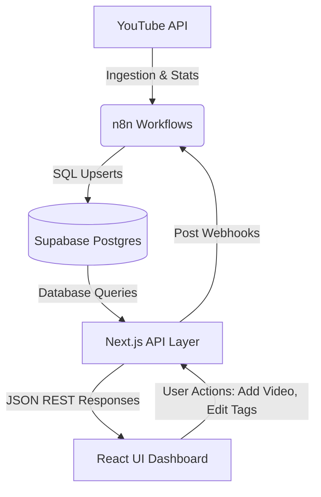
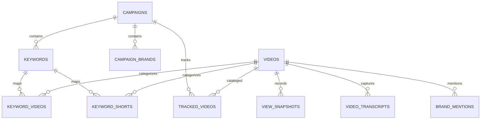

# YouTube Share-of-Voice (SOV) Dashboard
## Complete System Architecture & Data Flow Analysis

This document provides a detailed project manager's analysis of the **YouTube Share-of-Voice (SOV) Dashboard** system. It details how search rankings, video metrics, view growth, and brand representation data are fetched, stored, processed, and displayed on the client dashboard.

---

## 1. High-Level Architecture Overview

The system operates on a modern, decoupled stack consisting of:
*   **Ingestion & Execution Layer (n8n)**: A series of automated workflows scheduling and executing YouTube API scraping, video deduplication, transcript downloads, and AI brand-mention analysis.
*   **Database & Storage Layer (Supabase / PostgreSQL)**: Relational storage containing campaigns, tracked keywords, video metadata, daily view snapshots, AI-extracted transcripts, and campaign brand configs.
*   **Backend API Layer (Next.js App Router)**: Next.js API endpoints querying PostgreSQL, computing analytics, implementing public share snapshot logic, and managing server cache.
*   **Frontend User Interface (React / Tailwind v4 / Recharts)**: An analytical dashboard displaying brand charts, growth timetables, keyword activity heatmaps, and keyword/Shorts detail tables.

---

## 2. Ingestion Pipelines (n8n Workflows)

The lifecycle of YouTube data begins with the automated **n8n workflow pipelines**. The system manages several specialized workflows:

### Pipeline A: Keyword Discovery & Scraping
*   **WFI 1 - Keyword Intake** (Triggered via Frontend webhook: `POST /keyword-intake`):
    1.  Receives `text` (keyword), `category`, `campaign_id`, `campaign_name`, and `language`.
    2.  Validates that category is one of `['generic', 'branded', 'language', 'comparison']`.
    3.  Upserts the campaign to the `campaigns` table.
    4.  Inserts the keyword in the `keywords` table, marked as `pending`.
    5.  Creates an active scrape job in `scrape_jobs` with status `running`.
    6.  Triggers `WF2 - video scrapping` asynchronously and immediately responds with a success status to the client.
*   **WF4 - 7 Days Scheduler**:
    1.  Fires once every 7 days (scheduler trigger).
    2.  Fetches all active keywords in the system.
    3.  Iterates through them, initializing a new `scrape_job` and triggering `WF2 - video scrapping`.
*   **WF2 - Video Scrapping** (Sub-workflow):
    1.  **Quota Check**: Checks the `quota_usage` table to pick one of 10 configured API accounts (`account_1` to `account_10`) with the lowest daily usage.
    2.  **YouTube Search (Long-form)**: Queries YouTube Search API (`/youtube/v3/search`) for the keyword (filters: `type=video`, `maxResults=50`, `videoDuration=medium`, `regionCode=IN`).
    3.  **Deduplication**: Runs a SQL query (`Check Dedup`) to identify which returned video IDs already exist in the database for the active campaign.
    4.  **Process New Videos**: Fetches detailed video stats (snippet, statistics, contentDetails) via `/youtube/v3/videos`.
    5.  **Upsert & Snapshot**: Inserts new records into the `videos` table and records the initial metrics in the `view_snapshots` table.
    6.  **Create Keyword Mappings**: Inserts the new mapping in `keyword_videos` with the primary keyword name in the `keywords_appeared` array and the ranking in the `cross_keyword_ranks` array.
    7.  **Update Existing Mappings**: For videos already present in the database, updates `keyword_videos` by appending the current keyword and rank to the arrays and incrementing the `search_appearance_count`.
    8.  **Shorts Scrapping**: Repeats steps 2–7, querying YouTube search for `[Keyword] #shorts` (filter: `videoDuration=short`), and writes metadata to `keyword_shorts` instead of `keyword_videos`.
    9.  Updates the `scrape_job` record to `completed` and stamps `last_scraped_at` on the keyword row.

### Pipeline B: Daily Growth Tracker
*   **WF3 - Growth Tracker** (Runs daily at 8:00 AM):
    1.  Queries the database to retrieve all active (non-deleted) video IDs referenced in `keyword_videos`, `keyword_shorts`, or manually added `tracked_videos`.
    2.  Splits video IDs into batches of 50.
    3.  Queries YouTube video details (`/youtube/v3/videos`) for each batch.
    4.  **Flag Deleted Videos**: For any video IDs missing from the YouTube response (due to copyright, deletion, or privacy settings), updates `videos.is_deleted = true`.
    5.  **Insert Snapshots**: Inserts a new record into `view_snapshots` containing current views, likes, and comments.
    6.  **Calculate Growth**: Executes a Postgres window update using `LAG(...) OVER (PARTITION BY video_id ORDER BY snapshot_date)` to calculate daily, like, and comment growth percentages.

### Pipeline C: Manual Video Enrichment
*   **Video Enricher - Manual Add** (Triggered via `POST /webhook/enrich-video`):
    1.  Receives a manual YouTube URL from the user.
    2.  Uses regex to extract the 11-character video ID.
    3.  Queries YouTube API (`/youtube/v3/videos`) to fetch stats and details.
    4.  Upserts the record to the `videos` table.
    5.  Inserts initial views, likes, and comments into `view_snapshots`.
    6.  Maps the video to the current campaign by inserting it into `tracked_videos`.

### Pipeline D: Transcript Extraction & Brand Mention Detection
*   **WF5 - Transcript & Brand Mentions** (Runs daily at 2:00 AM):
    1.  Selects up to 200 videos lacking transcripts (`fetch_status NOT IN ('success', 'no_captions')`).
    2.  Downloads the YouTube watch page HTML, parsing out the `captionTracks` baseUrl.
    3.  Fetches caption XML/JSON from YouTube's server, processes the tags, and saves the text transcript to `video_transcripts` (status: `success` or `no_captions`).
    4.  Sends the transcript to Gemini-1.5-Flash (via OpenRouter API) to extract competitor brand mentions and count them.
    5.  Inserts brand mentions and contextual snippets (up to 3 context phrases per brand) into the `brand_mentions` table.

---

## 3. Database Schema

Below is the database schema representing the core entities of the SOV dashboard:

### Table Definitions

#### `campaigns`
*   `id` (UUID, Primary Key): Unique campaign identifier.
*   `name` (TEXT): Campaign name.

#### `campaign_brands`
*   `campaign_id` (UUID, Foreign Key -> campaigns.id): Associated campaign.
*   `name` (TEXT): Brand name (between 1 and 50 characters).
*   `created_at` (TIMESTAMPTZ): Entry creation timestamp.
*   *Primary Key*: `(campaign_id, name)`

#### `keywords`
*   `id` (UUID, Primary Key): Unique keyword identifier.
*   `text` (TEXT): Searched keyword.
*   `category` (TEXT): Keyword type (`generic`, `branded`, `language`, `comparison`).
*   `language` (TEXT, Nullable): Scraped language (e.g., `en`).
*   `campaign_id` (UUID, Foreign Key): Campaign ownership.
*   `last_scraped_at` (TIMESTAMPTZ, Nullable): Timestamp of the last scrape execution.

#### `videos`
*   `id` (UUID, Primary Key): Database video identifier.
*   `youtube_id` (TEXT, Unique): YouTube's 11-char video ID.
*   `title` (TEXT, Nullable): Video title.
*   `channel_name` (TEXT, Nullable): YouTube channel name.
*   `published_at` (TIMESTAMPTZ, Nullable): Video upload timestamp.
*   `duration` (TEXT, Nullable): Duration string (ISO 8601 format, e.g. `PT5M20S`).
*   `tags` (TEXT[], Default `{}`): Array of brand tags representing competitors.
*   `is_deleted` (BOOLEAN, Default `false`): Flags if the video is unavailable on YouTube.

#### `keyword_videos` (Long-Form Videos Mapping)
*   `keyword_id` (UUID, Foreign Key -> keywords.id): Source keyword.
*   `video_id` (UUID, Foreign Key -> videos.id): Target video.
*   `campaign_id` (UUID, Foreign Key -> campaigns.id): Target campaign.
*   `rank` (INTEGER): Relevance search rank (1-10).
*   `search_appearance_count` (INTEGER): Times this video appeared in keyword searches.
*   `keywords_appeared` (TEXT[]): Array of query keywords triggering this video.
*   `cross_keyword_ranks` (INTEGER[]): Array of ranks matching the keywords list.
*   `discovered_at` (TIMESTAMPTZ): Timestamp when first found.
*   `is_our_video` (BOOLEAN, Default `false`): Mark as owned brand content.
*   *Unique Index*: `(campaign_id, video_id)` WHERE `rank > 0`

#### `keyword_shorts` (YouTube Shorts Mapping)
*   *Matches `keyword_videos` structure but filters for short-form video metrics.*

#### `view_snapshots` (Daily Snapshot Table)
*   `video_id` (UUID, Foreign Key -> videos.id): Target video.
*   `snapshot_date` (DATE): Snapshot timestamp.
*   `view_count` (BIGINT): Aggregate view count.
*   `like_count` (BIGINT, Nullable): Aggregate like count.
*   `comment_count` (BIGINT, Nullable): Aggregate comment count.
*   `daily_delta` (BIGINT): Change in views since the previous snapshot.
*   `growth_percent` (NUMERIC): View growth percentage.
*   *Primary Key*: `(video_id, snapshot_date)`

#### `tracked_videos` (Manually Added Videos)
*   `video_id` (UUID, Foreign Key -> videos.id): Manual video.
*   `campaign_id` (UUID, Foreign Key -> campaigns.id): Target campaign.
*   `added_at` (TIMESTAMPTZ): Insertion timestamp.
*   *Unique Constraint*: `video_id` (each video can be manually tracked once per campaign)

#### `video_transcripts`
*   `video_id` (UUID, Primary Key): Associated video.
*   `youtube_id` (TEXT): YouTube ID.
*   `transcript_text` (TEXT, Nullable): Full text captions.
*   `language` (TEXT, Nullable): Caption language.
*   `fetch_status` (TEXT): CAPTION download status (`success`, `no_captions`, `failed`).
*   `fetched_at` (TIMESTAMPTZ): Timestamp when caption was downloaded.

#### `brand_mentions`
*   `video_id` (UUID): Associated video.
*   `youtube_id` (TEXT): YouTube ID.
*   `brand_name` (TEXT): Competitor/brand name mentioned.
*   `mention_count` (INTEGER): Number of times the brand was mentioned.
*   `mention_context` (TEXT[]): Text snippets showing context.
*   `analyzed_at` (TIMESTAMPTZ): Analysis execution time.
*   *Primary Key*: `(video_id, brand_name)`

---

## 4. Analytical Calculations & Business Logic

### A. Share of Voice (SOV) Calculations
Share of voice represents the percentage of total audience viewership a brand commands compared to competitor tags. It is computed at runtime in the Next.js query layer (`lib/queries.ts` -> `getBrandStats`):

$$\text{Brand SOV \%} = \left( \frac{\sum \text{Latest Views of Videos with Brand Tag } T}{\sum \text{Latest Views of All Tagged Videos}} \right) \times 100$$

*   **Our Share**: Determined by filtering videos present in `tracked_videos` or marked as `is_our_video = true` in keyword tables. The frontend highlights this as "OUR SHARE".

### B. Growth Period Calculations
Growth percentages are computed using snapshots across specific lookback dates:
*   The system collects unique snapshot dates (up to 90 days).
*   Determines lookback dates relative to the latest date:
    *   **24h**: Compare latest with `latestDate - 1` index.
    *   **7d**: Compare latest with `latestDate - 7` index.
    *   **30d**: Compare latest with `latestDate - 30` index.
*   Aggregated growth is calculated using:

$$\text{Period Growth Rate} = \frac{\sum \text{Delta Views across video pool}}{\sum \text{Views at start of period}} \times 100$$

### C. Duration Filter (Long-form vs Shorts)
The system separates long-form videos and shorts dynamically using the video's ISO 8601 duration:
1.  `parseDurationSeconds` converts strings like `PT1H2M3S` to total seconds.
2.  `isShortVideo(duration)` determines if a video is short if:
    $$\text{duration\_seconds} < 240\text{ seconds (4 minutes)}$$
3.  Long-form videos appear in the YTD tabs, and Shorts appear in the YTS tabs.

---

## 5. API Routes Layer (Next.js)

Next.js API routes act as the service layer handling server caching and data serialization:

*   `GET /api/overview/ytd` (Long-Form Data):
    *   Calls database helper functions: stats, top videos (by views, growth, search frequency), share timeline, brand performance, and keyword heatmap.
    *   Implements `revalidate = 60` (Vercel CDN caching for 60 seconds).
    *   Supports `shareToken` parameters to load historical snapshot data from `share_links` instead of live database state.
*   `GET /api/overview/yts` (Shorts Data):
    *   Mirrors YTD data fetching but calls corresponding Shorts queries (hitting the `keyword_shorts` table).
*   `POST /api/brands` & `DELETE /api/brands`:
    *   Handles manual creation and deletion of brand tags for campaigns using Supabase service-role credentials.
*   `POST /api/share-links`:
    *   Generates a snapshot payload containing YTD + YTS statistics, keywords metadata, and video arrays. Saves this payload directly into `share_links.snapshot_data` for public links.

---

## 6. Frontend Dashboard & UX Flow

The user interface uses visual elements to display YouTube performance:

1.  **Overview Tabs**: Swaps between long-form video metrics (YTD) and Shorts metrics (YTS) while managing client-side caching.
2.  **Summary KPIs**: Displays metrics such as Tracked Keywords, Total Views, Unique Channels, and Growth Percentages.
3.  **Share of Voice Pie Chart**: Displays market share using customized colors, showing the "Our Share" metric in the center.
4.  **Growth Leaderboard Tables**: Allows sorting videos by daily, weekly, or monthly view updates. Shows an emerald `👤 MY` badge next to owned brand content.
5.  **Frequency Cards**: Renders search appearances for videos appearing under multiple keywords.
6.  **Brand Tagging Input**: Displays inline dropdowns allowing operators to categorize videos by brand names on the fly, immediately rebuilding the charts.
7.  **Heatmap Chart**: Displays a color-coded grid representing daily keyword search volume variations over time.

---

## 7. Operational & Housekeeping Routines

To maintain system health, two automated n8n workflows run maintenance queries:
*   **WF6 - Snapshot Pruner** (Monthly at 2:00 AM):
    *   Deletes snapshots older than 90 days (`view_snapshots` pruning).
    *   Deletes completed/failed scrape jobs older than 30 days (`scrape_jobs` pruning).
*   **WF7 - Stuck Job Reaper** (Hourly):
    *   Finds any jobs stuck in `running` or `pending` status for over 2 hours and marks them as `failed`.
    *   Resets `last_scraped_at` to `NULL` for keywords associated with failed jobs, allowing them to be picked up in subsequent scraper cycles.
    *   Removes duplicate pending scrape jobs.
